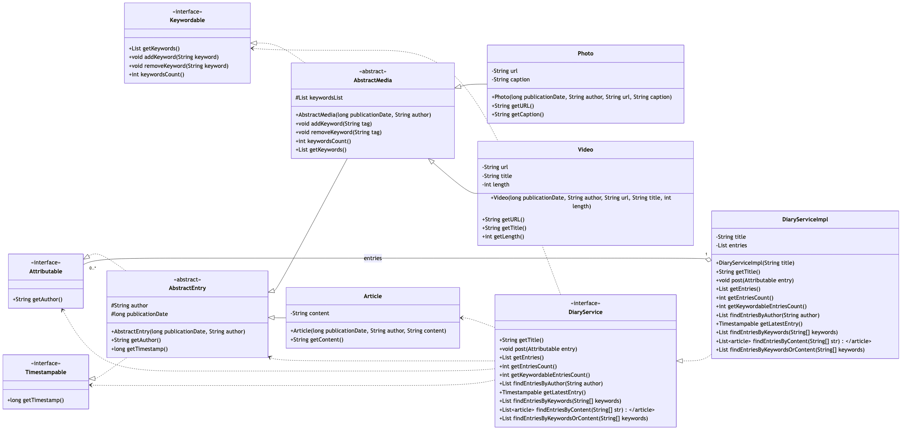

# Lab #5 - Polymorphisme, interface, classe abstraite, héritage et tests unitaires

## Objectifs

- Mettre en pratique les principes de conception orientée objet :
    - abstraction des comportements communs
    - spécialisation via héritage
    - polymorphisme pour manipuler des objets de natures différentes de façon uniforme
    - composition d'objets pour construire des structures plus complexes
- Structurer une solution Java propre et évolutive :
    - séparation des responsabilités
    - encapsulation de l'état interne
    - réutilisation de logique partagée via des bases abstraites
- Mobiliser les fonctionnalités essentielles du langage Java :
    - classes, interfaces, méthodes redéfinies
    - constructeurs et visibilité
    - collections, boucles et parcours d'objets
- Valider la qualité du code par les tests unitaires et la construction d'exemples d'instanciation représentatifs.


## Préliminaires

Vous réaliserez ce travail dans un dépôt Git local. Il vous est demandé de committer régulièrement vos contributions et de pousser celles-ci sur la plateforme GitLab de l'école.

Veillez à organiser votre dépôt de la manière suivante :

- un répertoire `src/` dans lequel vous placerez le code source de votre travail ;
- ne committez que le code source Java et non les versions compilées de vos programmes (fichiers `.class`). Pour cela, ajoutez le nécessaire dans le fichier `.gitignore`.

Pour cette séance, vous travaillerez dans le paquetage `diary` avec l'arborescence suivante :

```text
src/
  diary/
    Attributable.java
    Timestampable.java
    ...
```

## Rendu

Ce travail est à déposer sur la plateforme GitLab de l'école. Un premier rendu à la fin de la séance est obligatoire. Nous vous invitons à terminer l'ensemble de l'énoncé avant la prochaine séance.


## Travail à réaliser

L'objectif du TP est de développer un système informatique pour gérer un journal intime (ou un journal de bord). Ce système maintient une collection de billets agglomérés au fil du temps. Ces billets peuvent être des articles de texte (article), des images ou des vidéos.

Les billets de type image ou vidéo seront dits *keywordable* dans le sens où il sera possible de leur associer des mots clés (*keyword*). Il sera ainsi possible de rechercher tous les billets de ce type qui comporteront un certain ensemble de *keywords* (par exemple, tous les billets comportant les *keywords* `pasta` et `telecomnancy`). Au contraire, les billets de type article ne pourront être *taggés*, la recherche se fera alors sur le contenu de l'article.


### Compilation

Pour compiler vos classes, vous utiliserez donc les commandes suivantes.
On supposera que votre répertoire courant est le répertoire de votre
dépôt git local. Les fichiers compilés seront placés dans un dossier
`build/` (**Il se peut que vous deviez créer ce répertoire `build/`.**).


Pour compiler une classe que vous avez écrite, vous pouvez utiliser la commande suivante (par exemple la classe `diary.Attributable`) :

```sh
# pour compiler vos classes (par exemple, diary.Attributable)
javac -d build/ -cp src/:build/ src/diary/Attributable.java 
```


**Remarque :** Sous Windows, il faut généralement remplacer les caractères *slash* `/` par des *backslashs* `\` dans les chemins. Il faut également remplacer le caractère `:` par le caractère `;` utilisés comme séparateurs de chemins (par exemple dans le *classpath*). Enfin, il est recommandé d'entourer l'ensemble de la valeur du *classpath* (liste de chemins séparés par des `;`) par des *quotes* (`'`) pour éviter que le caractère `;` ne soit interprété comme un séparateur de commande.

Ainsi, la commande précédente sous Windows devrait s'écrire :
```bash
javac -d build -cp "src;build" src\diary\Attributable.java 
```

**Remarque :** Pour réussir à compiler certaines classes, vous devrez auparavant compiler les classes dont elles dépendent.


### Tests unitaires

Un ensemble de tests unitaires vous sont fournis afin de vérifier la
correction de votre code. Ces tests sont présents dans le dossier
`test/`. Ils sont écrits en utilisant la librairie JUnit5. Cette
librairie vous est fournie sous la forme d'une archive `.jar` présente
dans le répertoire `lib/`.

Pour exécuter une classe de tests, vous devrez d'abord la compiler, puis
l'exécuter.

```sh
# pour compiler une classe de test (diary.AttributableTest)
javac -d build/ -cp lib/junit-platform-console-standalone-6.0.3.jar:build/:test/ test/diary/AttributableTest.java

# pour exécuter cette classe de tests
java -jar lib/junit-platform-console-standalone-6.0.3.jar execute -cp=build/ --select-class=diary.AttributableTest
```

Si vous souhaitez exécuter toutes les classes de tests d'un package particulier, vous pouvez utiliser la commande suivante (par exemple pour le package `diary`) :
```sh
# pour exécuter toutes les classes de tests du package diary
java -jar lib/junit-platform-console-standalone-6.0.3.jar execute -cp=build/ --select-package=diary
```


### De manière automatisée (en utilisant Gradle)

Pour compiler et exécuter les tests (et gérer les dépendances nécessaires), vous pouvez utiliser un moteur de production tel que `Gradle` (https://gradle.org/).

Ce devoir est déjà configuré pour utiliser `Gradle`. Ainsi en utilisant la commande suivante, vous pouvez compiler l'ensemble de votre code source et exécuter les tests fournis :
```bash
./gradlew cleanTest test
```

Vous pouvez exécuter uniquement un certain test en précisant le nom de la classe de tests à exécuter en utilisant la commande suivante (par exemple pour la classe `diary.AttributableTest`) :
```bash
./gradlew test --tests diary.AttributableTest
```

**Remarque :** Tous les tests fournis ne peuvent compiler tant que vous n'avez pas écrit toutes les classes qu'ils testent. Nous avons donc dû exclure du processus de compilation la majorité des tests. Vous devrez donc les réactiver lorsque vous aurez écrit les classes requises. Pour cela, vous devrez éditer le fichier `build.gradle` et **commenter au fur et à mesure de votre progression** la ligne correspondant aux tests que vous souhaitez réaliser.


## Questions


Le diagramme ci-dessous illustre l'ensemble des classes et interfaces que vous avez à implémenter.




### Question 1

Implémentez une interface publique `diary.Attributable` dont le profil de méthode est le suivant :

- `String getAuthor()`

✅ Tests associés : `diary.AttributableTest`

### Question 2

Implémentez une interface publique `diary.Timestampable` dont le profil de méthode est le suivant :

- `long getTimestamp()`

✅ Tests associés : `diary.TimestampableTest`

### Question 3

Implémentez une classe abstraite `diary.AbstractEntry` qui réalise les interfaces `diary.Attributable` et `diary.Timestampable`.

Cette classe doit :

- conserver la date de publication (type `long`) et l'auteur du billet (type `String`) ;
- définir un constructeur dont les paramètres sont la date de publication puis l'auteur ;
- définir les méthodes de l'interface `diary.Attributable` ;
- définir les méthodes de l'interface `diary.Timestampable`.

✅ Tests associés : `diary.AbstractEntryDefTest`, `diary.AbstractEntryTest`

### Question 4

Implémentez une interface publique `diary.Keywordable` dont les profils de méthodes sont les suivants :

- `void addKeyword(String keyword)`
- `void removeKeyword(String keyword)`
- `int keywordsCount()`
- `List<String> getKeywords()`

✅ Tests associés : `diary.KeywordableTest`

### Question 5

Implémentez une classe abstraite `diary.AbstractMedia` qui hérite de `diary.AbstractEntry` et réalise l'interface `diary.Keywordable`.

Cette classe doit :

- conserver une liste de mots-clés ;
- définir un constructeur dont les paramètres sont la date de publication puis l'auteur ;
- définir les méthodes de l'interface `diary.Keywordable`.

Contraintes supplémentaires :

- `addKeyword()` ne doit pas ajouter deux fois le même mot-clé ;
- `getKeywords()` doit retourner une liste vide si nécessaire, jamais `null`.

✅ Tests associés : `diary.AbstractMediaDefTest`, `diary.AbstractMediaTest`

### Question 6

Implémentez une classe `diary.Article` qui hérite de `diary.AbstractEntry`.

Cette classe doit :

- conserver un contenu texte (corps du message) ;
- définir un constructeur avec les paramètres : date de publication, auteur, contenu ;
- définir la méthode `String getContent()`.

✅ Tests associés : `diary.ArticleDefTest`, `diary.ArticleTest`

### Question 7

Implémentez une classe `diary.Photo` qui hérite de `diary.AbstractMedia`.

Cette classe doit :

- conserver l'URL de l'image ;
- conserver la légende de la photo ;
- définir un constructeur avec les paramètres : date de publication, auteur, URL, légende ;
- définir les méthodes `String getURL()` et `String getCaption()`.

✅ Tests associés : `diary.PhotoDefTest`, `diary.PhotoTest`

### Question 8

Implémentez une classe `diary.Video` qui hérite de `diary.AbstractMedia`.

Cette classe doit :

- conserver l'URL de la vidéo ;
- conserver le titre de la vidéo ;
- conserver la durée (en secondes) ;
- définir un constructeur avec les paramètres : date de publication, auteur, URL, titre, durée ;
- définir les méthodes `String getURL()`, `String getTitle()` et `int getLength()`.

✅ Tests associés : `diary.VideoDefTest`, `diary.VideoTest`

### Question 9

Implémentez une interface publique `diary.DiaryService` dont les profils de méthodes sont les suivants :

- `String getTitle()`
- `void post(Attributable entry)`
- `List<Attributable> getEntries()`
- `int getEntriesCount()`
- `int getKeywordableEntriesCount()`
- `List<Attributable> findEntriesByAuthor(String author)`
- `Timestampable getLatestEntry()`
- `List<Keywordable> findEntriesByKeywords(String[] keywords)`
- `List<Article> findEntriesByContent(String[] str)`
- `List<AbstractEntry> findEntriesByKeywordsOrContent(String[] keywords)`

Comportements attendus :

- `findEntriesByKeywords()` doit retourner les billets contenant tous les mots-clés demandés ;
- `findEntriesByContent()` doit retourner les articles contenant tous les mots demandés ;
- `findEntriesByKeywordsOrContent()` doit combiner les deux recherches.

✅ Tests associés : `diary.DiaryServiceTest`

### Question 10

Implémentez une classe `diary.DiaryServiceImpl` qui réalise l'interface `diary.DiaryService`.

Cette classe doit :

- conserver le titre du journal (type `String`) ;
- conserver la liste des contenus publiés (type `List<Attributable>`) ;
- définir un constructeur dont le paramètre est le nom du journal ;
- définir les méthodes de l'interface `diary.DiaryService`.

Contraintes supplémentaires :

- les méthodes retournant une liste ne doivent jamais retourner `null` ;
- le contenu le plus récent est celui dont la date de publication (`long`) est la plus élevée ;
- `myStr.indexOf(lookingForStr)` retourne `-1` si la chaîne recherchée n'est pas contenue.

✅ Tests associés : `diary.DiaryServiceImplDefTest`, `diary.DiaryServiceImplTest`
